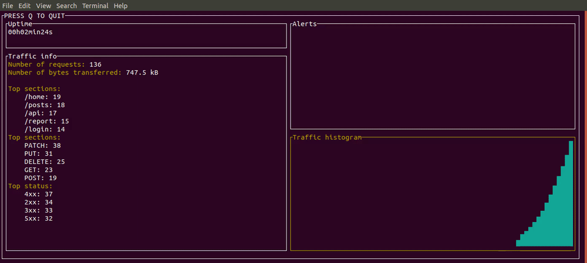

# HTTP Log-monitor


[](https://goreportcard.com/report/github.com/Baumanar/log-monitor) 
[](https://github.com/Baumanar/log-monitor/blob/master/LICENSE) 
[](https://godoc.org/github.com/Baumanar/log-monitor) 
 
[](https://codecov.io/gh/Baumanar/log-monitor)

A simple console program that monitors HTTP traffic on your machine. Listens to an actively written log file and displays statistics. 
- The console app displays stats every 10s about the traffic during those 10s: the sections of the web site with the most hits, as well 
as interesting summary statistics on the traffic as a whole.
- Whenever total traffic for the past 2 minutes exceeds a certain number on average, the app displays a message saying that “High traffic 
generated an alert - hits = {value}, triggered at {time}”. The default threshold is be 10 requests per second, and is be overridable.
- Whenever the total traffic drops again below that value on average for the past 2 minutes, the app displays another message detailing 
when the alert recovered



## Requirements

The project is written in Go and uses go modules. Developpement was made on go1.14.1 but was also tested on go1.13.

### Build

To build the project, run:
```sh
  go build
```

### Run

Once you built the project run:

```sh
  ./log-monitor
```

To exit the app, simply press Q.

The options of the program are the following:


```
Usage of ./log-monitor:
  -demo
    	demo or not, if demo the log file will be concurrently written with fake logs
  -logfile string
    	logfile path (default "/tmp/access.log")
  -threshold int
    	threshold for alerting in requests per second (default 10)
  -timewindow int
    	time window for alerting in seconds (default 120)
  -updateInterval int
    	number of seconds between each statistic update (default 10)
```
type ./log-monitor -help to display this message.

Example:
```sh
./log-monitor -logfile /tmp/access.log -threshold 10 -timewindow 60 -updateInterval 5
```

## Demo
If the ```demo``` flag is set to true, a separate ```log_generator``` goroutine writes the log file to simulate logging.
The evolution of the number of logs written follows a triangle pattern. With the default threshold (10 per second), the 
evolution of the traffic should trigger alerts approximately every 1-2 minute.

## Architecture

The architecture of the log-monitor has two main components:
- A monitor
- A display

The monitor communicates with the display by using two channels: one for statistics, one for alerts

The monitor listens to the log file and continuously checks for new logs. It keeps trace of the logs 
written during the last ```updateInterval``` seconds. Every ```updateInterval``` it computes statistics of the current 
logs and sends the computed statistics to the display by using the statistics channel. The statistics sent are:
- The 5 most requested sections
- The 5 most used  HTTP methods
- The 5 most frequent HTTP status codes returned
- The number of requests
- The number of bytes transferred

The monitor also checks for alerts, 
if the average traffic during the last ```timewindow``` exceeds the threshold per second, an alert is sent to the display. 
Alerts are sent by using the alert channel


The display uses [termdash](https://github.com/mum4k/termdash) which is a terminal based dashboard to display the important information.
It contains 4 panels:
- The uptime of the app
- The information panel on which statistics are displayed
- The alert panel on which alerts are displayed
- An histogram of the traffic evolution. The purpose of the histogram is just to give an intuition of the traffic evolution

## Improvements

The app could be improved in many ways:
- The monitor continuously checks for file modification, it would be better that file modifications trigger events. This could be maybe done by some package like 
[fsnotify](https://github.com/fsnotify/fsnotify) or [tail](https://github.com/hpcloud/tail)
- Improve the user interface. If I had more time, I think I would have implemented an interface available on a web browser for conviency
- Add performance benchmarks and do some pprof


